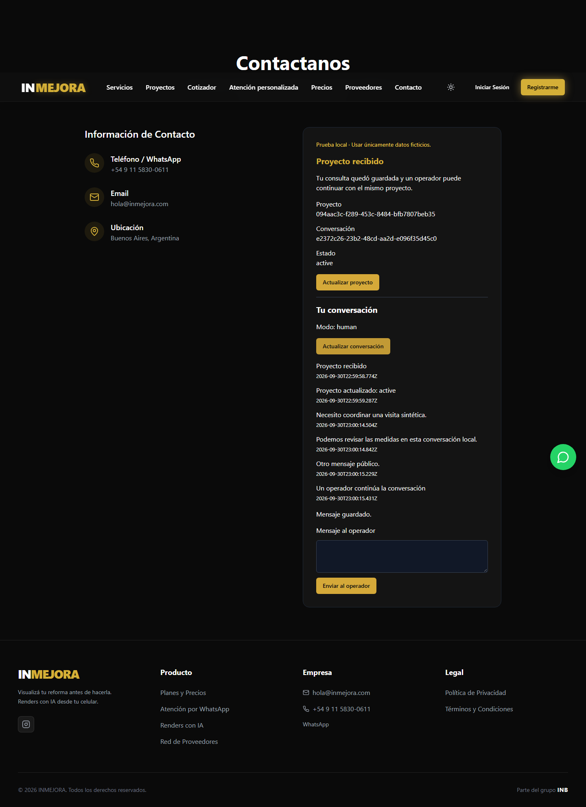
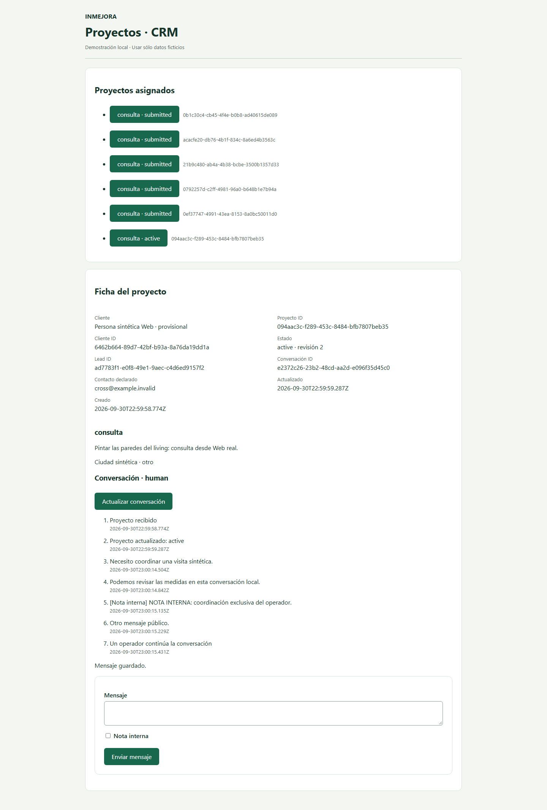

# Local conversation continuity — Web ↔ operator CRM

## Bases exactas y dependencia

| Repositorio | Padre autorizado | Rama hija |
|---|---|---|
| Web | #21 `6a52a156e8ba055cf83ca7b83de19e0b9e94d0b5` | `codex/web-local-conversation-continuity` |
| Dashboard | #39 `cde1af7caccedb1ed33900a09900fe5b394ef44b` | `codex/dashboard-local-conversation-continuity` |

Los heads padres se revalidaron antes de crear ramas y antes de publicar. Ambos PRs son DRAFT apilados sobre sus respectivos padres, nunca main. Core compañero: [Dashboard #48](https://github.com/jona2312/inmejora_dashboard_aprobacion/pull/48), SHA fijado por el runner **`6f301022400fea6c47aafe266204073f3f2b3c5e`**. No se cambian los padres.

## Flujo implementado

`/contacto` conserva el intake real de #21. Después de confirmar receipt y contexto, `ProjectThread.jsx` abre el hilo con **los IDs emitidos por Core**, muestra estado del proyecto, modo paused/human y timeline pública. El visitante envía texto al operador y puede refrescar explícitamente para ver su respuesta. No hay LLM, respuesta simulada, websocket ni otra conversación creada por esta UI.

`projectCoreClient.js` añade `thread(context)` y `message(context, content)` sobre el mismo transporte HTTP/cookie/CSRF local. Sólo proyecta eventos públicos, modo y permiso de escritura. Rechaza respuestas con notas internas, IDs de actores, par project/conversation distinto o secuencia desordenada. No almacena authority ni contexto en localStorage. El backend filtra datos antes de enviarlos; la validación del cliente es una comprobación adicional, no la autoridad.

| Operación | Endpoint existente |
|---|---|
| Recuperar capability/contexto | GET `/api/v1/intakes/current` |
| Leer hilo autorizado | GET `/api/v1/projects/:project/conversations/:conversation` |
| Mensaje de visitante/respuesta/nota del operador | POST `…/messages` |
| Handoff del operador asignado | POST `…/handoff` |

Mensaje: `{idempotency_key: UUID, content: string de 1–2000 caracteres, visibility: "client"}`. Web siempre proyecta `visibility=client`. Core rechaza keys desconocidas, incluyendo project/client/conversation/user IDs en el body. Handoff conserva `{idempotency_key, expected_revision}` y emite el evento existente `handoff.active` sobre el mismo hilo.

La ficha CRM de #48 reutiliza su timeline/composer/notas; agrega refresh explícito, confirmación, mutex de submit, retry y bloqueo de selección mientras hay operación pendiente. Permisos de escritura/handoff proceden de `ThreadView.can_message/can_handoff`; la API sigue verificándolos en cada petición. El operador necesita asignación explícita; no hay bypass por rol global.

## Idempotencia, secuencia y privacidad

- Cada mensaje nuevo genera una key aleatoria de operación. Body/key permanecen en memoria tras error, timeout o respuesta perdida; editar el formulario no altera una operación pendiente. Un guard sincrónico evita doble submit, también antes del rerender.
- El adapter no permite mover una operación pendiente a otro par project/conversation. CRM bloquea navegación de proyecto mientras se resuelve el envío. La confirmación sólo aparece después de una respuesta válida del Core, posterior al commit.
- Backend serializa escrituras mediante los locks/constraints existentes. La secuencia es emitida por PostgreSQL/Core, nunca por React. Retry idéntico no agrega evento; mismo key con otro actor/body entra en conflicto.
- Core filtra `visibility=internal` en las proyecciones del visitante y convierte `actor_user_id` a null para lectores sin permiso interno. Tampoco devuelve request hashes/keys, memberships o identity bindings. GET y POST usan la misma proyección.
- La nota interna sigue visible al operador asignado. El visitante y otro operador no asignado no la reciben. Los huecos en secuencia pública son esperables por el filtrado.
- Archivado conserva lectura autorizada y niega mensajes/handoff. Capability vencida recibe 404 en lectura del recurso y 401 en mutación/current; no se renueva silenciosamente por un error de mensaje.

## E2E correlacionado

**27/27 grupos PASS**: los 14 de intake de #21 permanecen, más 13 de conversación. Chromium real, Web real, Core hijo fijado y PostgreSQL 17.6 sintético; sin repositorio en memoria ni mocks de éxito. Los mensajes de ambos lados se escriben mediante UI y se verifican en la otra UI y en eventos persistidos.

| ID | Valor de la ejecución final |
|---|---|
| project_id | `094aac3c-f289-453c-8484-bfb7807beb35` |
| conversation_id | `e2372c26-23b2-48cd-aa2d-e096f35d45c0` |
| client_id | `6462b664-89d7-42bf-b93a-8a76da19dd1a` |
| lead_id | `ad7783f1-e0f8-49e1-9aec-c4d6ed9157f2` |

1. Visitante: «Necesito coordinar una visita sintética.»
2. CRM asignado ve ese mensaje y los mismos IDs.
3. Operador: «Podemos revisar las medidas en esta conversación local.»
4. Web refresca y ve la respuesta; no recibe la nota interna.
5. Handoff pasa paused → human con un evento auditado.
6. Restart del proceso Core sobre el mismo PostgreSQL conserva IDs, mensajes, secuencias y modo human. Ambas pantallas se recargan y vuelven a recuperar los datos.

[Evidencia JSON, escenarios exactos y eventos sintéticos](conversation-evidence/cross-repo.json).





Capturas inspeccionadas visualmente. La evidencia incluye sólo datos sintéticos y ningún token/cookie/secret. El JSON conserva eventos internos sintéticos del test para comparar con la proyección pública; no es una exportación de datos productivos.

## Negativos y gates

Los 13 grupos nuevos verifican intercambio por UI; respuesta/refetch; privacidad en GET/POST/current/project; handoff auditado; doble submit de visitante; pérdida de respuesta tras commit y retry de visitante; el mismo fallo/retry en CRM; proyecto/conversación cruzados, operador no asignado, UUID falso, visitante intentando nota interna e IDs inyectados; doble submit de operador; diez escritores concurrentes con retry y secuencia estable; restart; archivado; capability vencida. Todos los errores mantienen ausencia de confirmación ficticia. Los 14 escenarios anteriores incluyen timeout real del intake, CSRF, backend apagado y contacto igual en sesiones distintas.

| Gate | Resultado local |
|---|---|
| Web tests CI existentes | 70/70 PASS |
| Web adapter | 6/6 PASS (4 anteriores + 2 nuevos de privacidad/retry) |
| Web lint | 0 errores; 8 warnings heredados |
| Web build:ci | PASS |
| Web browser regression | 159 PASS; 1 skipped heredado para menú móvil en 1440px |
| Cross-repo E2E | 27/27 PASS |
| Core HTTP/PostgreSQL | 38/38 PASS (34 anteriores + 4 nuevos) |
| Core Chromium heredado | 7/7 boundaries PASS |
| Core/security typechecks | PASS |
| Core security suite heredada | 1149/1149 PASS |
| Dashboard build / build:project-core | PASS |
| Typecheck global Dashboard | 24 diagnósticos heredados exactos, cero nuevos |

Lockfiles y suites heredadas no cambian. La primera ejecución de conversación falló por esperar 401 donde el contrato devuelve 404 en lectura expirada; se corrigió el test, no el backend. La regresión local de Web encontró EPERM al limpiar resultados anteriores; se repitió con `--output .project-core-evidence/browser-results-conversation` sin modificar casos ni assertions. CI usa su checkout limpio y la configuración original. Los enlaces y resultados CI de ambos heads finales se registran en sus PRs.

## Reproducir

Usar Node 20.20.2, npm 10.8.2, pnpm 10.4.1 y Chromium, con acceso autorizado al repo privado del Core. Desde este checkout Web, preparar un checkout hermano `../identity-project-local-slice` del Dashboard **hijo**:

```sh
git -C ../identity-project-local-slice checkout --detach 6f301022400fea6c47aafe266204073f3f2b3c5e
pnpm --dir ../identity-project-local-slice install --frozen-lockfile --ignore-scripts
pnpm --dir ../identity-project-local-slice build:project-core
npm ci --ignore-scripts --no-audit --no-fund
npx playwright install chromium
npm run test:ci
npm run lint
npm run build:ci
npm run test:browser
npm run test:project-core
npm run test:project-core:e2e
```

Si el checkout no existe, clonar primero `jona2312/inmejora_dashboard_aprobacion` con acceso autorizado. También se acepta `PROJECT_CORE_CHECKOUT` absoluto. El runner exige SHA exacto y árbol tracked limpio; filtra entorno, no carga `.env` ni usa URLs/credenciales de servicios. En Linux se requiere hidratar los symlinks del paquete PostgreSQL fijado como documenta el workflow de #48. El harness abre/cierra sus propios procesos y elimina su cluster temporal. El E2E cross-repo sigue siendo local: CI del Web público no recibe credenciales para el Core privado ni contiene su código.

## Riesgos abiertos y siguiente slice

Sólo desarrollo/test loopback, sesiones de fixture y datos sintéticos. El aislamiento Windows es de runtime/navegador; no se presenta como firewall OS. No hay auth productiva, recuperación cross-device, drafts persistidos al cerrar pestaña ni paginación de timeline. Refresh es explícito; no se promete entrega push o lectura en tiempo real. Un permiso revocado se aplica en la siguiente petición; la pantalla puede conservar datos ya recibidos. Los caminos legacy/mocks inventariados en #21 siguen pendientes y no participan de esta conversación.

Siguiente único slice recomendado: paginación por cursor de timeline pública/operador con tests de concurrencia y filtrado de notas, manteniendo estos IDs y límites locales. No iniciado.

NO MERGE / NO DEPLOY / NO APPLY. Sin LLM/Assistant, n8n, Evolution, WhatsApp, Supabase LIVE, pagos, créditos, renders, ejecución Budget V2, Studio ni rate-limit. STOP para Jona/ARKOS.
