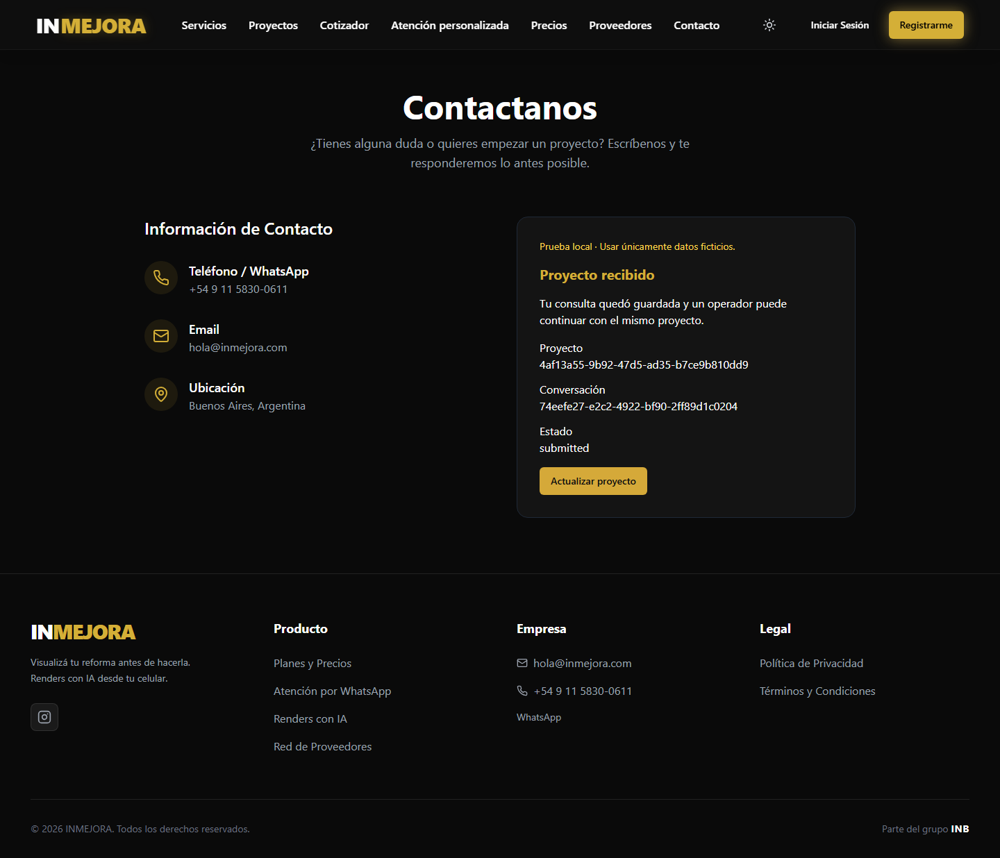
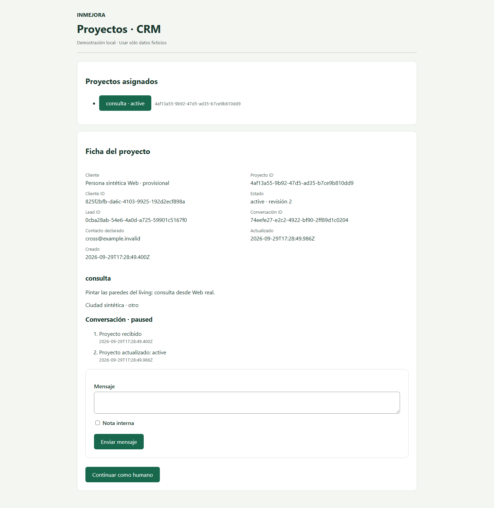

# Web → mismo Project Core local

Estado: **PASS local**, pendiente de revisión Jona/ARKOS. Sin merge, deploy, producción ni apply.

## Bases y alcance

- Web #20: `codex/web-consolidated-audited-baseline`, SHA exacto `14f1894ec2091497668b6a5c8609ef7fc36406f3`.
- Rama de esta integración: `codex/web-project-core-local-integration`; PR DRAFT contra esa base, nunca main.
- Dashboard/Core #39: `cde1af7caccedb1ed33900a09900fe5b394ef44b`, checkout limpio, sin modificaciones.
- El runner rechaza un Core con otro HEAD o cambios tracked. No incorpora código privado del Dashboard al repositorio Web.
- Sólo PostgreSQL efímero y sintético del harness existente de #39. No conexión a Supabase, staging ni producción.

## Formulario reutilizado

Se adapta [ContactoPage.jsx](../../src/pages/ContactoPage.jsx), ruta real `/contacto` registrada en `src/App.jsx`, ya enlazada desde la navegación y consultas. Conserva nombre, email, mensaje, layout, Header y Footer. En modo local agrega sólo localidad y consentimiento requeridos por `lead.v1`, estado de envío, error y confirmación verificable. No hay otra Home ni formulario de prueba sustituto.

La entrada representa una **consulta** (`category=consulta`, `intent=asesoria`, `property_type=otro`); no pretende producir un presupuesto ni inferir mediciones. `/presupuesto` tiene uploads, persistencia y WhatsApp legacy que requieren una migración posterior. Fuera del modo local, `/contacto` conserva el comportamiento honesto de #20: envío no disponible, sin confirmación ficticia.

## Adapter y transporte

[projectCoreClient.js](../../src/lib/projectCoreClient.js) consume exclusivamente HTTP relativo `/api/v1`. La activación requiere Vite DEV, modo `project-core-local` y `http://127.0.0.1`. Ningún import del frontend apunta al backend del Dashboard. Las reglas de ownership siguen exclusivamente en #39.

[local-web.mjs](../../scripts/project-core/local-web.mjs) inicia el Web real y un bridge HTTP de desarrollo entre puertos loopback. Valida Host y Origin de Web **antes** de adaptar Host/Origin al Core fijo. Sólo acepta destino literal `http://127.0.0.1:<puerto>` sin path/credenciales. No resuelve identidad, no escribe a BD y no decide autoridad. No está montado en el Vite normal ni en el build de producción.

El runner filtra variables de entorno, no carga `.env`, sustituye endpoints legacy por un destino loopback deshabilitado y añade CSP local. El harness de #39 bloquea sockets externos en Node; Chromium rechaza navegación/peticiones fuera de las dos origins locales, bloquea service workers y websockets. La ejecución registrada no intentó peticiones externas y no tuvo page errors. El aislamiento Windows es de runtime/navegador, **no un firewall del sistema**.

## Contrato HTTP utilizado

| Operación | Contrato y uso |
|---|---|
| GET `/api/v1/intakes/current` | Recupera CSRF y receipt/contexto permitido mediante cookie HttpOnly. Sólo un 401 inicial permite crear una sesión. |
| POST `/api/v1/intake-sessions` | Body `{}`; Core emite cookie scoped y CSRF. No crea el aggregate. |
| POST `/api/v1/leads` | Body estricto `lead.v1`. 201 después del commit; retry idéntico 200 con los mismos IDs. |
| GET `/api/v1/projects/:project_id` | Core verifica acceso; Web comprueba correspondencia de project/conversation con receipt antes de confirmar. |

Request proyectado explícitamente desde el formulario:

```json
{
  "schema_version": "lead.v1",
  "idempotency_key": "UUID aleatorio de operación, nunca identidad",
  "source": {"channel": "web", "path": "/contacto", "campaign": null},
  "project": {"category": "consulta", "locality": "dato del formulario", "zone": null,
    "property_type": "otro", "room": null, "measurements": null, "description": "mensaje"},
  "preferences": {"materials": null, "style": null},
  "attachment_refs": [], "intent": "asesoria",
  "contact": {"name": "nombre", "channel": "email", "email": "contacto@example.invalid"},
  "consent": {"contact_requested": true, "notice_version": "LOCAL-FIXTURE-1", "marketing": false}
}
```

La respuesta debe validar `intake-result.v1`, UUIDs, `user_id` nullable, status `received`, `project_state=submitted`, revision 1 y next_action `await_operator`. Luego se obtiene el contexto permitido. La UI conserva sólo `project_id`, `conversation_id` y estado; ni IDs ni CSRF se guardan en localStorage. Contacto no equivale a identidad. El navegador nunca asigna client/user/owner/membership.

## Idempotencia y errores

Un único Promise evita submits concurrentes. La primera operación conserva body y key en la closure; un error HTTP, red, timeout de 8 segundos o respuesta inválida mantiene ese mismo envío para retry. No se muestra éxito hasta validar receipt y contexto. Los campos quedan bloqueados mientras existe un envío pendiente, para no cambiar silenciosamente el body. Un 422 permite corregir el formulario; el Core garantiza que la validación ocurre antes de crear el aggregate. Los 401 del submit no generan otra sesión automáticamente.

El Core de #39 bloquea la sesión, valida hash/key y crea client/lead/project/conversation/receipt transaccionalmente. Un retry recibe el receipt original; un body/key diferente entra en conflicto. No se deduplica por teléfono/email. Dos sesiones con igual email crean clientes provisionales distintos y no pueden acceder al proyecto de la otra.

Reload recupera el proyecto ya confirmado y el estado actual a través de la cookie/current. El body pendiente vive sólo en memoria: no se promete persistir un borrador no confirmado al cerrar la pestaña, ni recuperar una capability vencida, eliminada o de otro dispositivo. No hay implementación de auth productiva, claim ni vinculación de clientes.

## Evidencia correlacionada

Run sintético registrado el 2026-09-29; consolidado el 2026-09-30. [Resultado y escenarios](evidence/web-core-e2e.json).

| Entidad | UUID emitido por el Core y verificado en PostgreSQL |
|---|---|
| client_id | `825f2bfb-da6c-4103-9925-192d2ecf898a` |
| lead_id | `0cba28ab-54e6-4a0d-a725-59901c5167f0` |
| project_id | `4af13a55-9b92-47d5-ad35-b7ce9b810dd9` |
| conversation_id | `74eefe27-e2c2-4922-bf90-2ff89d1c0204` |

El SQL del test une `leads_inmejora`, `preproyectos_inai` e `inmejora_core.project_conversations` en el fixture local; compara sus client_id con el receipt, respaldados por las foreign keys a `clientes`, y verifica las relaciones devueltas. El operador usa otro contexto Chromium con cookie firmada de fixture y la ficha real `/dev/project-crm` de #39. Se comprueba mismo cliente, proyecto, conversación y contacto. Tomar proyecto cambia estado a `active`; reload de Web recupera `active` con los mismos IDs.





Las imágenes fueron inspeccionadas visualmente. Son evidencia de datos sintéticos; no contienen cookies, tokens ni datos productivos.

## Gates y E2E exactos

| Gate local | Resultado |
|---|---|
| `npm ci --ignore-scripts --no-audit --no-fund` | PASS, lockfile intacto; Node 20.20.2 / npm 10.8.2 |
| `npm run test:ci` | **70/70 PASS**, cero omitidos |
| `npm run lint` | **0 errores, 8 warnings heredados** |
| `npm run build:ci` | PASS, Vite build con configuración sintética y guard offline de #20 |
| `npm run test:browser` | **159 PASS, 1 skipped heredado** (menú móvil en viewport desktop 1440); 160 casos en 360/390/768/1440 px |
| `npm run test:project-core` | **4/4 PASS**, sin skips |
| `npm run test:project-core:e2e` | **14/14 grupos PASS**, Chromium real + PostgreSQL 17.6 + Core exacto #39 |

No se redujeron ni alteraron tests existentes. El workflow offline de #20 conserva sus tres jobs y añade el gate del adapter. El E2E cross-repo se ejecuta localmente: el Core es un repo privado y este Web es público; no se copió el backend ni se provisionaron credenciales de acceso entre repositorios. CI de Web no afirma ejecutar ese E2E. Sus resultados locales versionados y el harness permiten repetirlo con acceso autorizado al Core. El estado CI del head final se entrega con el PR.

Los 14 grupos E2E cubren: formulario real y commit/receipt/cadena SQL; CRM con actor separado; reload/contexto sin identidad localStorage; doble submit (exactamente un aggregate); respuesta perdida después de commit y retry idéntico; CSRF inválido 403; timeout real tras commit y retry 200 sin duplicación; capability expirada 401 sin nueva sesión; UUID falso/proyecto ajeno 404 incluso con localStorage falsificado; client_id inyectado 422; user_id inyectado 422; mismo contacto en sesiones diferentes; Origin ajeno rechazado 403; Core realmente apagado 503 y recuperación con retry después de reiniciarlo. Los errores no presentan éxito. Las pérdidas de respuesta se inyectan después de un commit real; no hay mocks de éxito ni repositorio en memoria.

Un intento previo de Chromium fue interrumpido por `ERR_NETWORK_IO_SUSPENDED`; no cuenta como PASS. La ejecución final completa es la evidencia enlazada. Warnings de Browserslist y tamaño de chunks permanecen como deuda heredada.

## Reproducción

Requisitos: Git con acceso autorizado al Core privado, Node 20.20.2, npm 10.8.2, pnpm 10.4.1 y Chromium. No claves productivas ni `.env`. Usar un directorio padre con checkouts hermanos; desde Web:

```sh
git clone --no-checkout https://github.com/jona2312/inmejora_dashboard_aprobacion.git ../identity-project-local-slice
git -C ../identity-project-local-slice checkout --detach cde1af7caccedb1ed33900a09900fe5b394ef44b
pnpm --dir ../identity-project-local-slice install --frozen-lockfile --ignore-scripts
pnpm --dir ../identity-project-local-slice build:project-core
npm ci --ignore-scripts --no-audit --no-fund
npx playwright install chromium
npm run test:ci
npm run lint
npm run build:ci
npm run test:browser
npm run test:project-core
npm run test:project-core:e2e
```

Si ese directorio ya existe, verificar el SHA y árbol limpio en vez de clonarlo encima. Puede indicarse otro checkout mediante `PROJECT_CORE_CHECKOUT` (ruta absoluta). En Linux x64, antes del E2E hidratar los symlinks del paquete nativo, como exige el workflow de #39: desde `../identity-project-local-slice/node_modules/.pnpm/@embedded-postgres+linux-x64@17.6.0-beta.15/node_modules/@embedded-postgres/linux-x64`, ejecutar `node scripts/hydrate-symlinks.js`. No habilitar scripts globales de dependencias. El harness inicia y cierra PostgreSQL/Core/Web/Chromium y genera `.project-core-evidence/`; cada corrida tiene nuevos UUIDs sintéticos. La preparación necesita acceso a GitHub/registries; el escenario no necesita servicios externos.

## Inventario de legacy/mocks

Inventario de código, sin ejecutar caminos legacy ni consultar datos externos. Las clasificaciones se refieren a esta tranche; no equivalen a remediación productiva.

| Superficie existente | Clasificación | Pendiente / comportamiento |
|---|---|---|
| `pages/ContactoPage.jsx` `/contacto` | REPLACED BY PROJECT CORE | Sólo modo local. En modo normal sigue contenido por #20. |
| `components/RegistrationSection.jsx`, `hooks/useWebhookMessage.js` | NEEDS FUTURE MIGRATION | Home real registra contacto por `/api/webhook/guardar-mensaje`; aún no comparte project_id. |
| `components/Contacto.jsx`, `ContactForm.jsx`, `utils/supabaseUtils.js` contact submission | NEEDS FUTURE MIGRATION | Formulario antiguo con escritura `contact_submissions`; no montado por la Home actual. |
| `pages/PresupuestoPage.jsx`, `utils/presupuestoApi.js` | NEEDS FUTURE MIGRATION | `presupuestos_publicos`, fotos, heurística de contacto y salida WhatsApp legacy. Sin cambios. |
| `hooks/useLeadRegistration.js` | NEEDS FUTURE MIGRATION | `chat_session_id` localStorage, `/api/chat/register` y apertura/fallback WhatsApp. |
| `hooks/useChatLogic.js`, `contexts/ChatContext.jsx` | LEGACY HOLD | mockChatApi, respuestas/cuotas/session/user registrados en localStorage. No son identidad Core. |
| `contexts/SubscriptionContext.jsx` | LEGACY HOLD | Suscripción mock `sub-123`. No créditos ni suscripción Core. |
| `components/ScrollTriggerRegistrationModal.jsx` | LEGACY HOLD | Activación deshabilitada en App; marcador `inmejora_registered`. |
| Auth/login/register/reset y `identityContainment.js` | LEGACY HOLD | Contención #20 intacta; cached IDs no otorgan autoridad. |
| `utils/dashboardAPI.js`, `utils/rendersAPI.js`, uploads y botones de renders | LEGACY HOLD | Caminos heredados con identidad/token cacheados; no conectados al slice. |
| `supabaseUtils.js` newsletter / registro / pricing inquiry | NEEDS FUTURE MIGRATION | Escrituras legacy `newsletter_subscribers`, `users`, `pricing_inquiries`; no mapeadas automáticamente a cliente/proyecto. |
| `AIAssistantModal`, `AIAssistantPath`, `ManualQuoterPath`, `ServiceModal` | NEEDS FUTURE MIGRATION | Asistente/cotización/contacto legacy; enlaces preparados para WhatsApp no comparten contexto Core. |
| Header/Footer/ContactModal/WhatsAppButton, enlaces manuales de contacto | UNRELATED | Navegación estática conservada; el E2E no abre WhatsApp. |
| `proveedores/dashboard/CargarPreciosSection.jsx` | UNRELATED | Procesamiento simulado de proveedores, fuera de intake/CRM. |
| `UsageLogger.js` | UNRELATED | Telemetría legacy, no autoridad de proyecto; sin cambios. |
| Theme/CookieBanner | UNRELATED | Preferencias de UI en localStorage; no identidad ni ownership. |

## Límites y única recomendación siguiente

La integración es local. No habilita autenticación productiva, asociación por contacto, recuperación cross-device, pagos, créditos, renders, Budget V2, Assistant de negocio, n8n/Evolution, WhatsApp ni Studio. No hay migraciones Supabase. El aviso `LOCAL-FIXTURE-1` sólo es fixture. La cookie HttpOnly y el operador firmado provienen del Core de test; no se publica ningún endpoint para impersonar al operador. Las demás entradas legacy siguen pendientes. La continuidad demostrada cubre receipt/proyecto/estado/conversación; no una conversación Assistant funcionando.

**Un único siguiente PR recomendado, sujeto a nueva autorización:** continuidad conversacional local en `/contacto` utilizando los endpoints de mensajes ya presentes en #39, con respuesta del operador desde CRM sobre el mismo hilo, filtrado de notas internas y E2E bidireccional. Mantener los mismos pins y exclusiones; no iniciar esa tranche aquí.

STOP para revisión Jona/ARKOS. NO MERGE / NO DEPLOY / NO APPLY.
